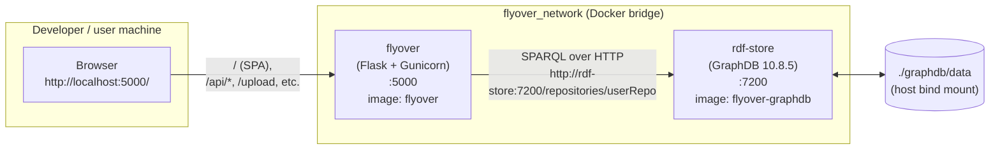
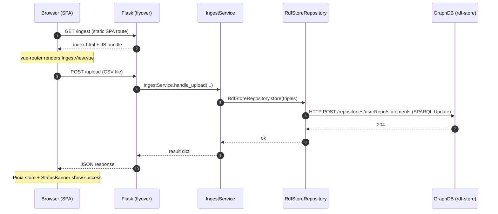
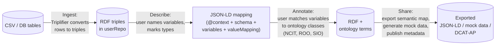

# Architecture

This doc maps the running system — what processes exist, how a browser request flows through them, and where data is stored. It also explains two concepts that are load-bearing but easy to get wrong if you don't know them: the GraphDB `userRepo`, and the JSON-LD mapping that ties the workflow steps together.

## System at a glance

Flyover runs as **two containers plus a browser**, defined in [`docker-compose.yml`](../docker-compose.yml):



- The browser only ever talks to **`flyover`** on port 5000. Flask serves the Vue SPA bundle (from `/app/flyover/spa/` inside the container) and exposes the JSON API. The SPA's `vue-router` lives at the base path `/`.
- **`flyover`** talks to **`rdf-store`** over the internal Docker network using its hostname `rdf-store`. There is no `host` networking; the bridge `flyover_network` keeps everything isolated from the rest of the host.
- The GraphDB home directory is persisted on the host at `./graphdb/data` (bind mount). That's where the actual triples live across restarts.

In **test mode**, [`docker-compose.test.yml`](../docker-compose.test.yml) overlays this stack to replace the bind mount with a tmpfs volume, so every test run starts from a clean GraphDB. See [`testing.md`](testing.md) for that story.

## Request lifecycle

A typical "user uploads a CSV" round trip:



Two things to notice:
- **Flask serves both the SPA and the API.** The SPA's HTML / JS / CSS are static files copied into the image at build time ([`Dockerfile`](../Dockerfile) stage 1 → stage 2). There is no separate static-asset server in production.
- **The Flask layer is thin.** Controllers do HTTP parsing and call services; services orchestrate; repositories own the SPARQL queries. This is the three-tier shape that lets the unit tests in [`tests/unit/`](../backend/flyover/tests/unit/) mock the repository without touching real GraphDB.

## Data flow: CSV → RDF → SPARQL → UI

Flyover's UI is four steps (Ingest → Describe → Annotate → Share), but it's easier to understand as four **data transformations** with a single durable artefact — the JSON-LD mapping — that survives between steps:



The JSON-LD mapping is **the** durable document that the user is editing across screens. Every Vue view either reads from it, writes to it, or both. The Flask backend keeps it in `session_cache` ([`main.py`](../backend/flyover/main.py) line 70 onwards), with the browser holding a copy in IndexedDB so reloads don't lose state.

## Backend layers

The Flask side at [`backend/flyover/`](../backend/flyover/) is organised as four layers:

- **[`controllers/`](../backend/flyover/controllers/)** — One Flask Blueprint per workflow step (`ingest_bp`, `describe_bp`, `annotate_bp`, `share_bp`). Each route does HTTP parsing only — pulls JSON or form data, calls a service, packages the response. Many landing routes are now just `redirect("/...")` because the SPA owns the page rendering.
- **[`services/`](../backend/flyover/services/)** — Business logic. `IngestService` runs the Triplifier and writes to GraphDB; `RdfStoreService` is the higher-level wrapper around the repository; `ShareService` does export and mock-data generation; etc. Services are the right place to add new behaviour — they're the layer the unit tests exercise most heavily.
- **[`repositories/`](../backend/flyover/repositories/)** — `RdfStoreRepository` owns the actual HTTP calls to GraphDB's REST API; `query_builder.py` constructs the SPARQL strings. Anything that touches `requests.post("http://rdf-store:7200/...")` belongs here.
- **`session_cache`** — A module-global instance of the `Cache` class in [`main.py`](../backend/flyover/main.py) (line 70, instantiated at line 140). Holds the current user's in-flight state: the loaded CSV, the JSON-LD mapping under construction, the list of variables, etc. It's process-local, so the app is **not** safe to scale horizontally without changes.

If you're hunting a bug, work from the outside in: controller → service → repository. The controller usually just hands the request body to the service.

## LLM mapping suggestions

An opt-in feature (compose overlay [`docker-compose.llm.yml`](../docker-compose.llm.yml), plus [`docker-compose.llm-gpu.yml`](../docker-compose.llm-gpu.yml) for NVIDIA acceleration) that prefills the describe forms with LLM-suggested mappings. With the default Ollama provider everything runs inside the compose network — no data leaves the deployment; cloud providers are supported behind an explicit consent gate (below).

**Providers** — a slim adapter interface ([`services/llm/base.py`](../backend/flyover/services/llm/base.py): `is_reachable()`, `ensure_ready()`, `match_equivalents(list_a, list_b)`) with three implementations selected by `FLYOVER_LLM_PROVIDER`. The matching kernel — prompt, output schema, validate + sanitise pipeline — is shared ([`services/llm/matching.py`](../backend/flyover/services/llm/matching.py)); adapters only do transport and structured-output negotiation:

| Provider | Backend | Structured output | Notes |
|---|---|---|---|
| `ollama` (default) | Ollama native `/api/chat` | native `format` grammar | Auto-pulls the model with fallbacks; classified **local** |
| `openai` | any `…/v1/chat/completions` endpoint (vLLM, LM Studio, llama.cpp, OpenAI, Azure, Mistral, Groq, OpenRouter, …) | `json_schema` strict, sticky fallback to `json_object` + schema-in-prompt | Requires explicit model + base_url; **remote** unless loopback or `FLYOVER_LLM_REMOTE=false` |
| `anthropic` | official `anthropic` SDK | `output_config.format` json_schema (guaranteed) | Default model `claude-opus-4-8`; always **remote** |

Why not an agent protocol (ACP/MCP/A2A)? Those standardise agent↔client or agent↔agent communication; Flyover's LLM use is a single stateless schema-constrained completion per chunk, so the right interoperability surface is the chat-completions API plus native adapters where they pay off.

**Remote gating** — a remote provider sends CSV column names, distinct categorical cell values, and semantic-map variable/term keys to an external service. That requires the operator's explicit `FLYOVER_LLM_ALLOW_REMOTE=true`; otherwise the feature disables itself with one boot warning. Classification is static per provider with a loopback carve-out and an explicit `FLYOVER_LLM_REMOTE` override (hostname heuristics were rejected: compose service names only resolve at runtime, and private-IP egress proxies would misclassify as local). The UI status bar always names the provider/model and shows an "external" badge for remote ones. See [`docker-compose.llm-cloud.example.yml`](../docker-compose.llm-cloud.example.yml).

**Backend** ([`services/llm/`](../backend/flyover/services/llm/), [`controllers/llm_controller.py`](../backend/flyover/controllers/llm_controller.py)):

- Each provider's `match_equivalents(list_a, list_b)` sends one schema-constrained chat request and returns `{item, match, confidence, reason}` per item, with hallucinated or duplicate matches nulled by the shared sanitiser.
- `LLMSuggestionService` runs two job phases as gevent greenlets on `session_cache.llm_jobs`: **variables** (CSV columns → semantic variable keys, chunked ~8 columns per request in form order) and **values** (categorical values → `valueMapping` terms, one chunk per variable). Jobs start automatically at ingest (data upload / semantic-map submission) and at `/units` submission, so the first chunks are usually done before the user reaches the page. Job fingerprints make starts idempotent; a generation counter cancels superseded workers; a failed chunk only errors its own items.
- The API under `/api/v1/llm/` exposes `status`, per-phase `suggestions` snapshots (polled by the frontend every 2 s), idempotent `.../start` endpoints, and `.../priority` for queue reordering (the "suggest this section first" buttons and page-change hints).

**Frontend** ([`stores/suggestions.js`](../frontend/src/stores/suggestions.js)): polls the snapshots, converts raw snake_case keys to display form, and merges arrivals into **untouched fields only** — never over user input, JSON-LD preselections, or dismissed suggestions. Applied fields carry a badge (confidence + model reasoning) until the user reviews them, and submitting with unreviewed AI fields asks for confirmation once. Suggestions flow through the same code paths as manual edits (`updateMappingFromForm` / `updateCategoryMapping`), so IndexedDB and the JSON-LD mapping stay consistent.

**Configuration** (env vars on the `flyover` service; resolution details in [`services/llm/config.py`](../backend/flyover/services/llm/config.py)):

| Variable | Default | Meaning |
|---|---|---|
| `FLYOVER_LLM_ENABLED` | `true` iff any LLM env var is set | Feature flag; off = zero LLM UI and zero background work |
| `FLYOVER_LLM_PROVIDER` | `ollama` | `ollama` \| `openai` \| `anthropic`; unknown values disable the feature |
| `FLYOVER_LLM_BASE_URL` | provider-dependent | Endpoint for ollama/openai. `FLYOVER_OLLAMA_HOST` remains a working alias |
| `FLYOVER_LLM_API_KEY` | — | Credential for openai/anthropic (anthropic also honors `ANTHROPIC_API_KEY`) |
| `FLYOVER_LLM_MODEL` | `llama3.2:3b` / `claude-opus-4-8` | Model per provider; **required** for openai |
| `FLYOVER_LLM_FALLBACK_MODELS` | `llama3.2:1b` (ollama only) | Comma-separated pull fallbacks |
| `FLYOVER_LLM_ALLOW_REMOTE` | `false` | Consent gate: required for any remote provider |
| `FLYOVER_LLM_REMOTE` | per provider | Explicit local/remote override (e.g. `false` for in-network vLLM) |
| `FLYOVER_LLM_CHUNK_SIZE` | `8` | Columns per matching request (variables phase) |
| `FLYOVER_LLM_TIMEOUT_S` | `180` | Read timeout per LLM request |

Latency expectations: a chunk is ~4–8 s on a GPU (first form page filled in ≤ 15 s; 100 columns in 1–2 min) and ~25–60 s on CPU — nothing blocks either way, fields simply fill in as chunks land. The suggestion jobs live on the process-local `session_cache`, which is also why gunicorn runs a single gevent worker (see [`backend/entrypoint.sh`](../backend/entrypoint.sh)) and why worker recycling (`GUNICORN_MAX_REQUESTS`) defaults to off.

## What is `userRepo`?

A GraphDB **instance** is one server. Inside it you can create many **repositories** — independent triple stores, each with its own ruleset (RDFS / OWL / none), storage, and access control. They don't share triples. Flyover uses exactly one repository called `userRepo`, configured by [`graphdb/data/data/repositories/userRepo/config.ttl`](../graphdb/data/data/repositories/userRepo/config.ttl).

Why this matters operationally:

- **In production**, `./graphdb/data` is bind-mounted into the container. GraphDB writes its repositories there. Restarting the container preserves data.
- **In tests** (`docker-compose.test.yml`), the bind mount is replaced with a tmpfs and the container starts blank. To make `userRepo` exist on a fresh boot, the `rdf-store` image bakes in a seed at `/opt/graphdb-seed/` (Dockerfile copies [`graphdb/seed/users.js`](../graphdb/seed/users.js), [`graphdb/seed/settings.js`](../graphdb/seed/settings.js), and the `userRepo/config.ttl`). The image's entrypoint, [`graphdb/seed-entrypoint.sh`](../graphdb/seed-entrypoint.sh), does a non-clobbering `cp -rn /opt/graphdb-seed/. /opt/graphdb/home/` before launching GraphDB. On a bind-mounted prod start, that copy skips everything (files already exist); on a fresh tmpfs, it populates the empty store with the seed.

The seed contains stock GraphDB defaults only — single admin user with the documented default password. **Never commit live user state into `graphdb/seed/`.**

The Flask backend learns which repository to use from the env var `FLYOVER_REPOSITORY_NAME=userRepo` (set in [`docker-compose.yml`](../docker-compose.yml)). Changing that without also seeding a config.ttl for the new repository will break ingest.

## What is JSON-LD?

JSON-LD is JSON with one extra key: `@context`. The context maps every other key in the document to a URI, so the same document is both **valid JSON** (parseable by anything) and **an RDF graph** (every key:value becomes a triple). It's how Flyover stores semantic mappings without forcing users to think in triples.

Here's a stripped-down example pulled from [`tests/conftest.py::sample_jsonld_mapping`](../backend/flyover/tests/conftest.py):

```jsonc
{
  "@context": {                                  // tells RDF tools what each key MEANS
    "@vocab": "https://github.com/MaastrichtU-CDS/Flyover/",
    "schema": "schema/",
    "mapping": "mapping/"
  },
  "@id": "https://flyover.example.org/mapping/test",  // global identifier for this document
  "@type": "mapping:DataMapping",                // RDF class — "this is a DataMapping"
  "name": "Test Mapping",
  "schema": {
    "@type": "schema:SemanticSchema",
    "prefixes": {                                 // ontology prefixes used downstream
      "ncit": "http://ncicb.nci.nih.gov/xml/owl/EVS/Thesaurus.owl#",
      "roo":  "http://www.cancerdata.org/roo/"
    },
    "variables": {
      "biological_sex": {
        "@type": "schema:CategoricalVariable",
        "predicate": "roo:P100018",               // RDF predicate to use
        "class":     "ncit:C28421",               // ontology class for the variable
        "valueMapping": {
          "terms": {
            "male":   { "targetClass": "ncit:C20197" },  // value → ontology term
            "female": { "targetClass": "ncit:C16576" }
          }
        }
      }
    }
  }
}
```

If you've worked with plain JSON, the only new ideas are: `@id` (global identifier), `@type` (RDF class), `@context` (key → URI map). Everything else is just nested objects. The [json-ld.org primer](https://www.w3.org/TR/json-ld11/) is the canonical 30-minute read.

## Learn more

- [W3C RDF 1.1 Primer](https://www.w3.org/TR/rdf11-primer/) — what triples and SPARQL even are
- [JSON-LD 1.1 Primer](https://www.w3.org/TR/json-ld11/) — the only document you need on JSON-LD itself
- [GraphDB Documentation](https://graphdb.ontotext.com/documentation/10.8/) — especially the "Repositories" and "REST API" sections
- [Flask Blueprints](https://flask.palletsprojects.com/en/stable/blueprints/) — Flyover's controllers are blueprints
- [GO-FAIR — FAIR Principles](https://www.go-fair.org/fair-principles/) — what Flyover is helping users achieve

If something here is wrong or unclear, fix it — that's the easiest contribution you'll ever make.
