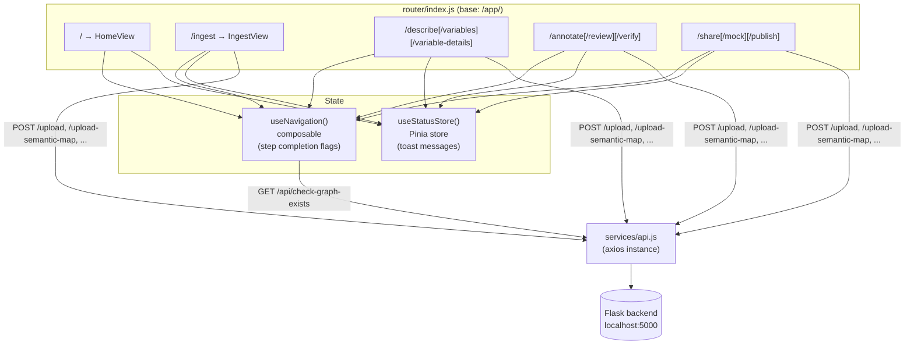

# Frontend (Vue 3 SPA)

This doc explains the Vue side of Flyover for someone who knows JavaScript and HTTP but hasn't worked with Vue before. By the end you should know what every file under [`triplifier/frontend/src/`](../triplifier/frontend/src/) does, how the SPA talks to Flask, and how to add a new route.

## The stack in one paragraph

A Single Page Application built with **Vue 3** (the component framework), **Vite** (the dev server and bundler), **Vue Router** (URL-to-component mapping with no full page reloads), **Pinia** (reactive cross-component state — Vue's blessed store library), and **Axios** (HTTP client). Every component is a Single File Component (`.vue`) using the Composition API with `<script setup>` syntax — a leaner alternative to the older "Options API" you might see in tutorials from 2020. The TypeScript toolchain (`vue-tsc`) is present but not strict; `.js` and `.vue` files don't currently use types.

## Code map

```
triplifier/frontend/
├── index.html                       # static shell; <div id="app"> and legacy CSS <link>s
├── package.json                     # npm scripts and deps
├── vite.config.js                   # build config + dev-server proxy to Flask
├── vitest.config.js                 # unit-test config (extends vite.config.js)
├── playwright.config.js             # E2E test config — see testing.md
└── src/
    ├── main.js                      # app entry: createApp → use(pinia, router) → mount('#app')
    ├── App.vue                      # shell: AppNav, <RouterView/>, AppFooter, StatusBanner
    ├── assets/main.css              # the only Vue-owned CSS (layout overrides)
    ├── router/index.js              # the 11 routes (lazy-loaded), base path /app/
    ├── views/                       # one component per route
    │   ├── HomeView.vue
    │   ├── IngestView.vue
    │   ├── DescribeLandingView.vue
    │   ├── DescribeVariablesView.vue
    │   ├── DescribeVariableDetailsView.vue
    │   ├── AnnotationLandingView.vue
    │   ├── AnnotationReviewView.vue
    │   ├── AnnotationVerifyView.vue
    │   ├── ShareLandingView.vue
    │   ├── ShareMockView.vue
    │   └── SharePublishView.vue
    ├── components/                  # shared bits used across views
    │   ├── AppNav.vue               # breadcrumb / step navigator
    │   ├── AppFooter.vue
    │   ├── StatusBanner.vue         # renders Pinia 'status' store messages
    │   └── MigrationStub.vue        # legacy placeholder, gone soon
    ├── composables/
    │   └── useNavigation.js         # workflow-step state (which steps are completed, disabled)
    ├── stores/
    │   └── status.js                # Pinia store: toast/banner messages
    └── services/
        └── api.js                   # axios instance, baseURL '/'
```

## Routes, composables, and the store at a glance



## How dev mode works

Two processes, side by side.

```bash
# terminal 1 — Flask backend (Docker is easiest; or run uv directly)
docker compose up -d triplifier   # or: cd triplifier/backend/data_descriptor && uv run python data_descriptor_main.py

# terminal 2 — Vite dev server with HMR
cd triplifier/frontend
npm install
npm run dev                       # serves the SPA at http://localhost:5173/app/
```

Open `http://localhost:5173/app/`. The Vite dev server has HMR (hot module replacement): edit a `.vue` file and the browser re-renders without losing component state.

**Why does the SPA talk to Flask in dev mode?** Because the dev server is a different port (`5173`), normally the browser would block API calls to `5000` as cross-origin. [`vite.config.js`](../triplifier/frontend/vite.config.js) avoids that by proxying a curated list of paths through the dev server itself:

```js
server: {
  proxy: {
    '/api':                          'http://localhost:5000',
    '/upload':                       'http://localhost:5000',
    '/upload-semantic-map':          'http://localhost:5000',
    '/upload-annotation-json':       'http://localhost:5000',
    '/start-annotation':             'http://localhost:5000',
    '/static':                       'http://localhost:5000',
    // …and a few more
  },
}
```

So a SPA call to `/api/check-graph-exists` from `:5173` is silently forwarded to Flask on `:5000`. **If you add a new API route in Flask, you'll likely need to add a proxy entry too**, otherwise it works in production but 404s in dev.

In production, both are served from the same Flask process on `:5000` (Vite isn't running), so the proxy table is irrelevant. The multi-stage [`Dockerfile`](../triplifier/Dockerfile) builds the SPA in stage 1 (Node) and copies `dist/` into `/app/data_descriptor/spa` in stage 2 (Python); Flask serves it as static.

## How to add a new route

Concrete example: adding `/describe/units`.

1. **Create the view component** at `src/views/DescribeUnitsView.vue`:

   ```vue
   <script setup>
   import { ref, onMounted } from 'vue'
   import api from '@/services/api'

   const units = ref([])

   onMounted(async () => {
     const { data } = await api.get('/units')
     units.value = data
   })
   </script>

   <template>
     <div>
       <h2>Units</h2>
       <ul><li v-for="u in units" :key="u">{{ u }}</li></ul>
     </div>
   </template>
   ```

2. **Register the route** in [`src/router/index.js`](../triplifier/frontend/src/router/index.js):

   ```js
   { path: '/describe/units', name: 'describe-units',
     component: () => import('@/views/DescribeUnitsView.vue') },
   ```

   Keep the lazy-import pattern — it keeps the initial bundle small.

3. **(Optional) Surface it in the nav** by adding an entry to `STEPS` in [`composables/useNavigation.js`](../triplifier/frontend/src/composables/useNavigation.js) if it's a top-level workflow step, or just link to it from another view with `<RouterLink to="/describe/units">`.

That's it. Vite picks up the new files on save. If `/units` is a new Flask endpoint too, add a proxy entry to `vite.config.js` so dev mode works.

## Composables vs Pinia: when to use which

A common point of confusion. Both let you share logic between components.

- **A composable** (`use*` function) is a plain JS function that returns reactive refs and computed values. Use it for **stateless or per-call logic**: encapsulating a fetch + parse pattern, deriving step-completion flags from URL state, wrapping `fetch` with retries. Multiple components call the composable independently and get their own state.
  - Example: [`useNavigation()`](../triplifier/frontend/src/composables/useNavigation.js) — derives "which workflow step is active / completed" from the current route. Note the one-shot `primed` flag at the top of the module: it fires `/api/check-graph-exists` exactly once across all consumers, then shares the resulting `dataExists` ref module-wide. This is a deliberate "singleton via module scope" pattern.
- **A Pinia store** is global, shared, reactive state with explicit actions. Use it when **multiple components need to mutate or subscribe to the same state**: a notification queue, a logged-in user, the current JSON-LD mapping.
  - Example: [`useStatusStore()`](../triplifier/frontend/src/stores/status.js) — any component can call `useStatusStore().error('upload failed')` and the message instantly appears in the `StatusBanner` rendered by `App.vue`. There's only one banner; only one store.

Rule of thumb: if removing the feature wouldn't lose information across components, it's a composable; if you'd lose a shared list / queue / object, it's a store.

## Why the legacy CSS

The SPA inherits styling from the pre-Vue (jQuery + Flask templates) era of Flyover. [`index.html`](../triplifier/frontend/index.html) `<link>`s to several stylesheets served by Flask under `/static/css/`: Bootstrap, FontAwesome, plus project-specific `flyover-custom.css` and `share.css`. Those files live under [`triplifier/backend/data_descriptor/static/`](../triplifier/backend/data_descriptor/static/), not in the frontend tree.

The Vue side only owns [`src/assets/main.css`](../triplifier/frontend/src/assets/main.css) (layout overrides) and scoped CSS inside each `.vue` file's `<style scoped>` block. Component-local styles use scoped CSS; project-wide visual changes mean editing files under the Flask `static/` tree.

This is awkward but deliberate: replacing Bootstrap and the design tokens is a much bigger project than the SPA migration. Keep new component styles `<style scoped>` and the boundary stays manageable.

## Learn more

- [Vue 3 guide — Introduction](https://vuejs.org/guide/introduction.html) — start here if Vue is new. Read at minimum the **Essentials** chapter (reactivity, components, lifecycle).
- [Vue Composition API & `<script setup>`](https://vuejs.org/api/sfc-script-setup.html) — every `.vue` file in this repo uses this style.
- [Vue Router 4](https://router.vuejs.org/) — focus on the **Essentials**: dynamic routes, navigation, `<RouterView>`, `<RouterLink>`.
- [Pinia](https://pinia.vuejs.org/core-concepts/) — short docs. We use the "setup store" pattern (a function passed to `defineStore`), not the older options-object pattern.
- [Vite guide](https://vitejs.dev/guide/) — read the **Server Options** section to understand the dev-server proxy.
- [Axios](https://axios-http.com/docs/intro) — only the basics; we don't use interceptors yet.
- [Vue Mastery — Vue 3 Tutorial (free)](https://www.vuemastery.com/courses/intro-to-vue-3/intro-to-vue3/) — a video walkthrough if reading docs isn't your thing.

If something here is wrong or unclear, fix it — that's the easiest contribution you'll ever make.
