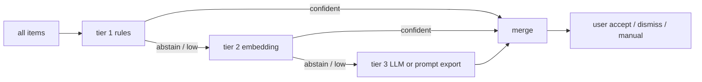
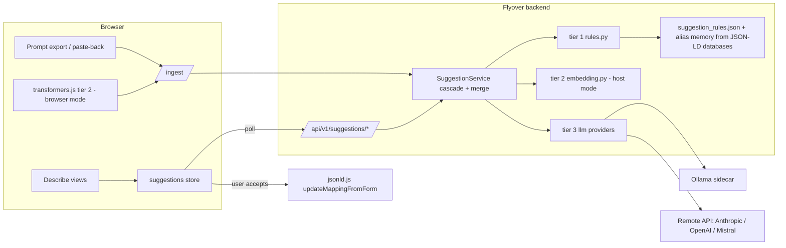

# Tiered mapping suggestions — epic overview

Epic for [#35](https://github.com/MaastrichtU-CDS/Flyover/issues/35) (mapping recommendations on the describe pages). This folder holds one paste-ready Markdown file per sub-issue plus this shared overview. The issue files reference this README for everything they have in common (suggestion contract, API, cascade rules, compute flag) and only spell out their own deltas.

| # | Issue file | Delivers | Blocks |
|---|---|---|---|
| 1 | [01-tier1-rule-based-suggestions.md](01-tier1-rule-based-suggestions.md) | Tier 1 (alias memory + value regex + fuzzy strings) **and** the shared backend/frontend suggestion infrastructure | 2 |
| 2 | [02-llm-prompt-export-roundtrip.md](02-llm-prompt-export-roundtrip.md) | Copy-prompt / paste-answer round-trip with any external LLM (permanent fallback, [#139](https://github.com/MaastrichtU-CDS/Flyover/issues/139)) | 3 |
| 3 | [03-tier2-embedding-model.md](03-tier2-embedding-model.md) | Tier 2 small multilingual embedding model; first real use of `FLYOVER_SUGGESTION_COMPUTE` | 4 |
| 4 | [04-tier3-integrated-llm.md](04-tier3-integrated-llm.md) | Tier 3 integrated LLM (Ollama sidecar or Anthropic / OpenAI-compatible / Mistral) harvested from `feature/llm-mapping-suggestions` | — |

Issue N blocks issue N+1. Tier 1 is merged as soon as it is done so the shared contract is in `main` before the next tier starts. Related earlier issues: [#57](https://github.com/MaastrichtU-CDS/Flyover/issues/57), [#137](https://github.com/MaastrichtU-CDS/Flyover/issues/137), [#138](https://github.com/MaastrichtU-CDS/Flyover/issues/138), [#139](https://github.com/MaastrichtU-CDS/Flyover/issues/139).

## Problem

On `DescribeVariablesView` users pick, per local column, one variable from `schema.variables`; on `DescribeVariableDetailsView` they map each distinct value to a `valueMapping.terms` key. For a real site that is hundreds of columns and thousands of values, filled in by hand. Sites differ wildly in naming (English headers vs. Dutch abbreviations vs. opaque codes) and in what they can run (4-core/8 GB air-gapped boxes up to GPU hosts), so no single technique fits everyone. We therefore climb a ladder: cheap deterministic tiers first, models only for what remains, and always a human at the end.

Ground truth exists: the [AYA cancer semantic map](https://github.com/STRONGAYA/AYA-cancer-semantic-map) has one branch per site whose `databases` section contains completed mappings (NKI-Amsterdam alone: 566 columns, 546 with `localMappings`). We use it both for the examples in these issues and as the benchmark.

## Tier ladder

| Tier | Technique | Runs where | Cost | Offline? | Expected yield (AYA) |
|---|---|---|---|---|---|
| 1 | Alias memory harvested from other sites' `databases`; value-type regexes on distinct values; normalised token similarity with margin abstain | Backend, pure Python | Milliseconds | Yes | Column names: site-dependent, low on NKI (`Rnnummer`, `alg_v1b`, `surv70`), high on English-header sites. Values: high everywhere (`{ja,nee}`, `{M,F}`, ICD-O, TNM, years, missing codes) |
| 2 | Multilingual sentence-embedding model (~120 MB quantised ONNX), cosine similarity + margin abstain, only on tier-1 abstains | Backend (`host`) or Web Worker (`browser`) | Seconds for ~600 columns on 4c/8 GB | Yes, bundle shipped in image/volume | Descriptive non-English names: `jaar_van_diagnose → year_of_initial_diagnosis`, `leeft → age_at_initial_diagnosis` |
| prompt | Auto-generated prompt copied into any approved LLM chat; answer pasted back | Backend generates, user's LLM elsewhere | Free for us | Yes (LLM is the user's problem) | Whatever the user's LLM can do; permanent fallback |
| 3 | Integrated LLM: Ollama sidecar or remote API, only on escalated items with tier-1/2 candidates as hints | Backend job | Minutes for hundreds of columns with a 3B CPU model | Sidecar yes, remote no | Semantics that need context (`taal → administered_prom_language`); still not opaque codes |
| human | Explicit accept / dismiss / manual pick | Browser | — | — | Everything else (`surv70 → eortc_qlq_c30_q6` without a codebook) |

## Shared suggestion contract

Every tier produces the same record. It is cherry-picked from `matching.py` `MATCH_OUTPUT_SCHEMA` (`item, match, confidence, reason`) on the LLM branch and extended with `source`, `tier`, `status`.

```json
{
  "item": "morf",
  "match": "tumour_morphology_icd_o",
  "confidence": 0.92,
  "reason": "Alias: column 'morph' in database 'christie' is mapped to this variable",
  "source": "alias",
  "tier": 1,
  "status": "done"
}
```

| Field | Type | Rules |
|---|---|---|
| `item` | string | The local thing being mapped (column name or distinct value) |
| `match` | string \| null | Exact key from the schema side; `null` = abstain. Never a free-text label |
| `confidence` | number 0..1 | Clamped server-side |
| `reason` | string | Non-empty, human-readable; shown in the UI tooltip |
| `source` | enum | `alias`, `value_regex`, `string`, `embedding`, `llm`, `pasted_llm`, `manual` |
| `tier` | 1 \| 2 \| 3 | `pasted_llm` is reported as tier 3 |
| `status` | enum | `pending`, `running`, `done`, `failed`, `unavailable` |

**Key conventions** (mirror the describe views' form state):

- Variables phase: key `${db}_${column}`; `match` ∈ `Object.keys(schema.variables)`.
- Values phase: key `${db}_${column}_${value}`; `match` ∈ `Object.keys(schema.variables[v].valueMapping.terms)` for the variable the column is mapped to.

Records are held in the backend job snapshot and mirrored in the Pinia `suggestions` store. They are **never** written into the JSON-LD; only an explicit user accept calls `jsonld.updateMappingFromForm` / `updateCategoryMapping`, exactly as a manual pick would.

## API

All tiers sit behind one blueprint, `app/backend/data_descriptor/controllers/suggestions_controller.py` (the branch's `/api/v1/llm/*` routes renamed).

```
GET  /api/v1/suggestions/status                        # tiers active|inactive(reason), compute mode, model/provider names
POST /api/v1/suggestions/{variables|values}/start      # body: {tiers?: [1,2,3], force?: bool}
GET  /api/v1/suggestions/{variables|values}            # job snapshot: status, progress, records keyed by item key
POST /api/v1/suggestions/{variables|values}/priority   # bump items visible on the current page (from branch)
POST /api/v1/suggestions/{variables|values}/ingest     # browser-computed (tier 2) or pasted (prompt) records; validated
GET  /api/v1/suggestions/prompt?phase=&database=       # issue 2: prompt text + JSON answer schema
GET  /static/models/<bundle>/...                       # issue 3, browser mode only
```

Backend module layout:

```
app/backend/data_descriptor/
  controllers/suggestions_controller.py
  services/suggestions/
    __init__.py            # SuggestionService: jobs, fingerprint, cascade, merge
    contract.py            # record contract + JSON schema (from matching.py)
    prompt_export.py       # issue 2
    tiers/rules.py         # tier 1
    tiers/embedding.py     # tier 2, host mode
    tiers/llm/             # tier 3: base, config, factory, providers, matching
  resources/suggestion_rules.json
  tests/unit/test_suggestions_*.py
app/frontend/src/stores/suggestions.js
app/frontend/src/components/SuggestionBadge.vue
app/backend/scripts/benchmark_suggestions.py
```

## Cascade and merge rules

Cascade by **confidence**, not by count.

1. Every enabled tier is run in order 1 → 2 → 3, but tier *n+1* only receives items whose best record so far is `match: null` or has `confidence < FLYOVER_SUGGESTION_THRESHOLD` (default `0.8`, tuned by the benchmark).
2. Within a tier, a matcher must **abstain** when its top-2 candidates are closer than a margin (default `0.05`, `DEFAULT_MARGIN`). This is what stops string similarity from confidently mapping `surv1 → q1` for a site with `surv1..surv72` against `eortc_qlq_c30_q1..q30` — the real mapping is `surv70 → eortc_qlq_c30_q6` and only a codebook or the human knows that. The fuzzy alias matcher additionally rejects near hits whose labels differ only in digits and abstains when its two best candidates with distinct targets sit within the margin.
3. Merge: per key, the record with the highest confidence wins; on a tie the **lowest** tier wins (cheaper and deterministic). Only losing records with a **non-null match different from the winner's** are kept in `alternatives` for the UI popover; abstains and duplicates of the winner are dropped. When every matcher abstains, the reason that names the margin wins, so the most informative diagnosis reaches the UI.
4. User marks (`applied`, `touched`, `dismissed` in the store) are never overwritten by a later job; `force: true` only clears machine records. When a job with a new fingerprint arrives, marks expire **per key**: a mark survives while the suggestion it was made against (its `match`) is unchanged, so a stale dismissal can never hide a different suggestion but finished reviews are kept.
5. One-variable-per-database constraint: if two columns get the same `match` in the variables phase, the strongest candidate keeps it and the losers are nulled with a `reason` naming the winning column, and the winner keeps each loser's match in its `alternatives` so the user still sees what it lost to. (Decision D2: the original "downgrade both" rule was dropped — a hint on the winner is more useful than two abstains.)



## Compute location and tier flags

Both live in `docker-compose.yml` on the `flyover` service, next to the existing `FLYOVER_*` variables.

```yaml
- FLYOVER_SUGGESTION_TIERS=${FLYOVER_SUGGESTION_TIERS:-1}        # comma list of enabled tiers
- FLYOVER_SUGGESTION_COMPUTE=${FLYOVER_SUGGESTION_COMPUTE:-host}  # host | browser
- FLYOVER_SUGGESTION_THRESHOLD=${FLYOVER_SUGGESTION_THRESHOLD:-0.8}
```

Users often reach Flyover through an SSH tunnel, and either end may be the heavier machine. `FLYOVER_SUGGESTION_COMPUTE` decides where model inference happens:

| Tier | `host` | `browser` |
|---|---|---|
| 1 | Backend Python (always) | Same — flag is a no-op |
| prompt | Backend generates prompt, user's LLM elsewhere | Same |
| 2 | `tiers/embedding.py` with `onnxruntime` on the host | Backend serves the bundle from `static/models/`; `src/lib/embeddingWorker.js` (transformers.js, WASM/WebGPU) computes in a Web Worker and posts to `/ingest` |
| 3 | Ollama sidecar or remote API from the host | Prompt export (issue 2); WebLLM in-browser is a stretch goal |

`/api/v1/suggestions/status` reports the effective mode and, per tier, `active` or `inactive` with a reason (`disabled by FLYOVER_SUGGESTION_TIERS`, `model bundle not found`, `remote provider not allowed`, …). The UI shows this; nothing degrades silently.

### Environment matrix

| Environment | Recommended | Notes |
|---|---|---|
| 4 cores / 8 GB, air-gapped | `TIERS=1`, prompt export via an internally approved LLM | Tier 2 possible if the bundle is shipped in the image; expect ~10 s for 600 columns |
| Heavy laptop, SSH tunnel to a small VM | `TIERS=1,2 COMPUTE=browser` | Model bundle downloaded once from the backend, inference in the browser |
| Small laptop, SSH tunnel to a GPU host | `TIERS=1,2,3 COMPUTE=host` + `docker-compose.llm.yml` (+ `llm-gpu.yml`) | Ollama sidecar on the host |
| Cloud-permitted deployment | `TIERS=1,2,3` + `docker-compose.llm-cloud.example.yml`, `FLYOVER_LLM_ALLOW_REMOTE=true` | Anthropic / OpenAI-compatible / Mistral |

## Architecture



## Benchmark protocol

`app/backend/scripts/benchmark_suggestions.py` (issue 1) is the yardstick for every later tier and for setting thresholds. It leaves one **site** out (all of a site's databases hidden together) and runs through `SuggestionService` itself; see [`benchmark-results.md`](benchmark-results.md) for the full protocol.

- Fetches the `databases` slice of each AYA site branch on demand (nothing large is committed); caches under `$TMPDIR`.
- For each site: hides that site's own `databases` entry (so alias memory only sees *other* sites), runs the requested tiers over its columns and `localMappings`, compares against the committed `mapsTo` / term keys.
- Reports per tier and cumulative: recall@1, recall@3, abstain rate, false-accept rate (confident but wrong), wall-clock time; per site and pooled (~3,500 column labels, thousands of value labels across 7 branches).
- Thresholds in the issues marked `TBD from benchmark` are filled from the first run and recorded in the benchmark output committed as `docs/mapping-suggestions/benchmark-results.md`.

## Invariants (apply to every issue)

1. **Schema/data separation.** Tiers read `schema` plus column metadata (`column_info`, distinct values) and write nothing into the JSON-LD. Rule data lives in `resources/suggestion_rules.json` or is harvested from `databases` at runtime; nothing site-specific ever lands in `schema`.
2. **No auto-write.** A suggestion may pre-fill a dropdown in the view for display, but it becomes a mapping only through an explicit review in the UI (accept, or a manual change); unreviewed pre-fills are excluded from the JSON-LD writers and keep a visually distinct "needs review" state (`SuggestionBadge`) until reviewed or dismissed (decision D1).
3. **Exact keys only.** `match` is validated server-side against the schema keys for the phase (`sanitise_pairs` semantics) for every source, including `/ingest`.
4. **Never fetch at runtime.** Model bundles are in the image or a mounted volume; the only outbound traffic is the explicitly allowed remote LLM provider in tier 3.
5. **Visible availability.** Every tier is `active` or `inactive(reason)` in `/status` and in the UI.
6. **Human last.** Nothing is locked in; the user can always override any suggestion.

## Remediation decisions (D1–D5)

Decisions taken during the tier-1 remediation review
([`01a-tier1-remediation.md`](01a-tier1-remediation.md)):

- **D1 — Pre-fill vs pre-highlight.** The describe views pre-fill the
  dropdown for display, but nothing reaches the JSON-LD until the user
  reviews the field; the reload logic restores pre-fills from the marks,
  not from the JSON-LD.
- **D2 — Conflict rule.** The strongest candidate keeps the variable and
  the losers are nulled with a reason naming the winner; the winner also
  carries each loser's match in `alternatives`. (Supersedes rule 5's
  original "downgrade both".)
- **D3 — Marks on a new fingerprint.** Marks expire per key, not
  wholesale: a mark survives while the suggestion it was made against is
  unchanged in the new job.
- **D4 — IngestView FK review gate.** Moved to its own branch/PR; it was
  never part of the tier-1 plan and rendered outside
  `FLYOVER_SUGGESTION_TIERS`.
- **D5 — Value-based variable suggestions.** Stay disabled (collecting
  distinct values costs one store query per column); the
  `{M,V} → biological_sex` and year-abstain criteria moved to a
  follow-up issue.

## Glossary

- **Item / key** — the local column (`${db}_${column}`) or value (`${db}_${column}_${value}`) a suggestion is about.
- **Match** — a `schema.variables` key or a `valueMapping.terms` key; never a label.
- **Abstain** — a record with `match: null`; the item is escalated to the next tier.
- **Alias memory** — column-name → variable pairs harvested from every `databases.<db>` in the loaded JSON-LD via `forEachColumn`.
- **Fingerprint** — hash of the phase's items plus the rules `version` and a hash of the alias memory (every remembered database/column/variable pair); a job is reused only while the fingerprint is unchanged, so a rules bump or another site's review expires the cache.
- **Compute mode** — `host` or `browser`, see above.
- **Escalation** — passing an item to the next tier because the current best record is an abstain or below threshold.
