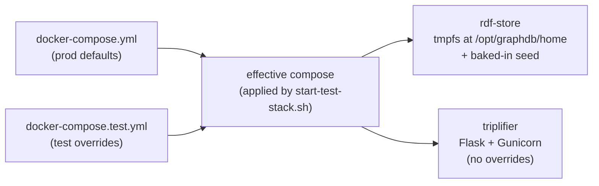

# Testing

Three test layers, each with a different speed/realism trade-off. This doc tells you what each layer does, how to run it locally, and when to write which kind of test.

## Three layers

| Layer        | Tool                | Lives at                                                              | What it tests                                                              | Speed       | CI workflow                                                                 |
|--------------|---------------------|-----------------------------------------------------------------------|----------------------------------------------------------------------------|-------------|-----------------------------------------------------------------------------|
| Backend unit | pytest              | [`triplifier/backend/data_descriptor/tests/unit/`](../triplifier/backend/data_descriptor/tests/unit/) | Services, repositories, controllers — mocked GraphDB                       | <2 s        | [`unit-tests.yml`](../.github/workflows/unit-tests.yml)                     |
| Backend integration | pytest       | [`tests/integration/`](../triplifier/backend/data_descriptor/tests/integration/) | Loaders, validators — real files, no network                               | ~seconds    | (runs as part of unit-tests, if added to selection)                         |
| Frontend unit | Vitest             | [`triplifier/frontend/tests/unit/`](../triplifier/frontend/tests/unit/) | Stores, composables, view components — happy-dom, no backend               | <2 s        | [`frontend-checks.yml`](../.github/workflows/frontend-checks.yml)           |
| Frontend E2E | Playwright          | [`triplifier/frontend/tests/e2e/`](../triplifier/frontend/tests/e2e/) | Multi-page workflow against a real stack (Flask + GraphDB)                 | ~minutes    | [`frontend-smoke.yml`](../.github/workflows/frontend-smoke.yml) (1 spec); [`frontend-e2e-full.yml`](../.github/workflows/frontend-e2e-full.yml) (all specs) |

Plus a non-test code-quality job: [`code-quality.yml`](../.github/workflows/code-quality.yml) runs Black, flake8, mypy, Bandit, and Safety. See the **CI workflow map** below.

## Running tests locally

### Backend (pytest)

```bash
# from the repo root; uses uv to spin up an ephemeral env
cd triplifier/backend/data_descriptor
uv run --with-requirements ../requirements.txt --with pytest --with pytest-mock \
  python -m pytest tests/unit/ -q
```

Add `--cov=. --cov-report=term-missing` if you want a coverage rollup. Drop `tests/unit/` and target a single file or class for faster iteration.

A few practical notes about the layout:
- [`tests/conftest.py`](../triplifier/backend/data_descriptor/tests/conftest.py) defines fixtures shared across `unit/` and `integration/` (sample DataFrame, JSON-LD mapping, mock RDF responses).
- [`tests/unit/conftest.py`](../triplifier/backend/data_descriptor/tests/unit/conftest.py) adds unit-only stubs so unit tests stay isolated from real deps. Integration tests deliberately don't inherit those stubs.
- Many test modules do `sys.path.insert(0, str(Path(__file__).parent.parent.parent))` to make `data_descriptor` importable as a top-level package. If you add a new test under a new sub-folder, mirror that pattern.

### Frontend unit (Vitest)

```bash
cd triplifier/frontend
npm install                  # first time only
npm run test:unit            # one-shot
npm run test:unit:watch      # watch mode while you edit
```

Vitest runs in [`happy-dom`](https://github.com/capricorn86/happy-dom) — a lightweight DOM implementation — so components can mount, render, and emit events without a real browser. Specs live in `tests/unit/{stores,lib,views}/*.spec.js`. There's no backend; calls through `services/api.js` should be mocked (look at existing view specs for the pattern).

### Frontend E2E (Playwright)

Playwright assumes the stack is **already running** on `http://localhost:5000`. The Playwright config doesn't auto-start anything.

```bash
# 1. install browsers once
cd triplifier/frontend
npm run test:e2e:install     # downloads chromium ~150 MB

# 2. bring up the test stack (tmpfs GraphDB + Flask)
./../../scripts/start-test-stack.sh

# 3. run the smoke spec (fast — ~30s)
npx playwright test tests/e2e/smoke.spec.js --reporter=line

# 4. or run the whole suite (a few minutes)
npm run test:e2e

# 5. teardown
docker compose -f ../../docker-compose.yml -f ../../docker-compose.test.yml down -v
```

On failure, Playwright drops a `playwright-report/` HTML report and a `test-results/` dir with traces and screenshots. Open the report with `npx playwright show-report`.

## The Docker test stack



The overlay does two important things:

1. **Replaces the GraphDB bind mount with a tmpfs.** Prod mounts `./graphdb/data` from the host to persist state. Tests mount a 2 GB tmpfs to `/opt/graphdb/home`, so every `up` starts from an empty store. Faster, hermetic, and avoids polluting your dev triples.
2. **Builds the `rdf-store` image locally from [`graphdb/Dockerfile`](../graphdb/Dockerfile)** instead of pulling the prod image. The locally built image bakes in `users.js`, `settings.js`, and `userRepo/config.ttl` as a seed under `/opt/graphdb-seed/`. On container start, [`graphdb/seed-entrypoint.sh`](../graphdb/seed-entrypoint.sh) does a non-clobbering `cp -rn /opt/graphdb-seed/. /opt/graphdb/home/` — on an empty tmpfs that copies the seed in (so `userRepo` exists); on a bind-mount with existing state the copy is a no-op.

The startup script [`scripts/start-test-stack.sh`](../scripts/start-test-stack.sh) brings the stack up and polls until both `http://localhost:7200/rest/repositories` returns `userRepo` and `http://localhost:5000/app/` returns 200, then exits.

## When to write what kind of test

```
Is the thing under test pure Python with deterministic inputs/outputs?
  └── yes → pytest unit (tests/unit/)
  └── no  → does it touch the filesystem or read fixture files?
            └── yes → pytest integration (tests/integration/)
            └── no  → is it a Vue component, store, or composable?
                      └── yes → Vitest (frontend/tests/unit/)
                      └── no  → does it exercise a multi-page user workflow?
                                └── yes → Playwright (frontend/tests/e2e/)
                                └── no  → reconsider whether it needs a test; if it does, you probably have the layers wrong
```

Practical heuristics:

- **Prefer the cheaper layer.** A unit test runs in milliseconds; an E2E test takes minutes and is flakier. If you can mock a service and unit-test the handler logic, do that first.
- **Don't unit-test what Vitest is good at.** Component rendering, click handlers, derived UI state belong in Vitest, not in Playwright. Playwright is for "does the whole ingest workflow still work?", not "does this button enable when the field is filled?"
- **One E2E happy-path per workflow** is the goal — that's what `smoke.spec.js` is for. The richer specs (`ingest.spec.js`, `annotate.spec.js`, etc.) cover the variants and run nightly.

## CI workflow map

All of these live in [`.github/workflows/`](../.github/workflows/).

| Workflow                  | Triggers                                                  | Blocking?       | What it does                                                                                      |
|---------------------------|-----------------------------------------------------------|-----------------|---------------------------------------------------------------------------------------------------|
| `unit-tests.yml`          | push to `main`, all PRs                                   | yes             | pytest unit tests with coverage; fails the build on any failure                                   |
| `frontend-checks.yml`     | push to `main`, all PRs (frontend paths)                  | yes             | ESLint, `vue-tsc` type-check, Vitest, Vite production build                                       |
| `frontend-smoke.yml`      | push to `main`, all PRs                                   | yes             | Brings up the tmpfs test stack and runs `smoke.spec.js` only                                      |
| `frontend-e2e-full.yml`   | nightly cron 03:00 UTC; manual dispatch; PRs with label `run-full-e2e` | no | Full Playwright suite against the test stack                                                      |
| `code-quality.yml`        | push to `main`, all PRs                                   | partial         | Black (auto-applies and commits with `[skip ci]`), flake8, mypy, Safety (HIGH severity blocking), Bandit |
| `release.yaml`            | tag push                                                  | n/a             | Builds and publishes the production triplifier + graphdb images to ghcr.io                        |

### The Copilot-PR approval gate

PRs from `copilot/*` branches do **not** auto-run CI. A maintainer has to open the PR's *Checks* tab and click **Approve and run workflows** before any job fires. This is a GitHub org-level setting, not anything in this repo. If you see a Copilot PR with no checks queued at all, that's why — give it the approval click and the workflows fire.

## Learn more

- [Playwright — Getting started](https://playwright.dev/docs/intro) — read at minimum the "Writing tests" and "Test runners" pages. The [Trace Viewer](https://playwright.dev/docs/trace-viewer-intro) tutorial is worth doing once.
- [Vitest guide](https://vitest.dev/guide/) — the API is very close to Jest if you've used that.
- [Vue Test Utils](https://test-utils.vuejs.org/guide/) — what you'll reach for when writing component tests in Vitest.
- [pytest fixtures](https://docs.pytest.org/en/stable/explanation/fixtures.html) — `conftest.py` patterns, fixture scopes, parametrize.
- [The Practical Test Pyramid (Martin Fowler)](https://martinfowler.com/articles/practical-test-pyramid.html) — the philosophy behind the unit / integration / E2E split.

If something here is wrong or unclear, fix it — that's the easiest contribution you'll ever make.
