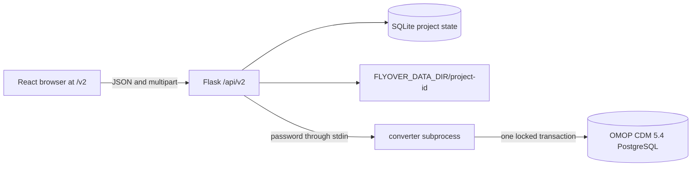

# Flyover v2 architecture

Flyover v2 is a second application mounted at `/v2` and `/api/v2`. The Vue/legacy application remains at `/` and its routes, global cache, IndexedDB workflow and RDF store are unchanged. The two versions can therefore be tested against the same fixtures before cut-over.

## Runtime and privacy boundary



SQLite is authoritative for project metadata, immutable revisions, job state, artifact metadata and audit events. Large or private material is stored beneath one project directory:

```text
FLYOVER_DATA_DIR/
├── flyover-v2.sqlite3
└── <project UUID>/
    ├── sources/       uploaded CSV
    ├── profiles/      private aggregate profiles
    ├── mappings/      immutable requirement and mapping snapshots
    ├── jobs/          sanitized conversion intermediates
    └── artifacts/     downloadable converter output
```

Imported sources and state snapshots use a temporary file plus `fsync` and atomic rename. Converter artifacts receive unique names and become visible only after the converter reports success. User filenames are reduced to a safe basename and a generated prefix. Project UUIDs and resolved paths are checked before filesystem access.

Source rows and category profiles do not leave the local deployment. A PostgreSQL password is accepted only by terminology, preflight or conversion requests. For conversion, Flask sends the target object over the child process's standard input; it is never placed in an argument, SQLite record, artifact, audit event or report. A server restart marks an interrupted job `retryable`, because its password no longer exists.

## Domain modules

- `contracts.py` owns the JSON-LD and local-mapping rules. It has no Flask or database dependency.
- `profiling.py` reads every CSV column as text before deriving deterministic type and numeric statistics with Polars.
- `database.py` is the only SQLite repository. Alembic upgrades it on startup.
- `files.py` is the only project-file writer.
- `terminology.py` performs exact URI namespace and OMOP vocabulary resolution. It never performs fuzzy matching.
- `converters/base.py` defines the public converter interface. Built-ins and allowlisted entry points use the same interface.
- `converters/omop.py` first builds complete in-memory CDM batches, then opens one advisory-locked PostgreSQL transaction.
- `api.py` translates HTTP into these domain services and returns one error shape.

These boundaries are intentionally unremarkable Python. Researchers can test `OmopBatchBuilder` with a CSV and dictionaries without starting Flask or PostgreSQL.

## Versioned semantic contracts

A v2 requirement is JSON-LD with `formatVersion: "2.0"`. Existing `schema.variables`, `mapsTo`, `localColumn` and `localMappings` remain valid. The optional `targets.omop` extension is converter-specific; optional variable `constraints` remain converter-neutral.

The local table mapping declares `layout` and `roles`. A long mapping uses a small equality filter:

```json
{
  "mapsTo": "schema:variable/weight",
  "localColumn": "result_value",
  "when": {"column": "result_type", "equals": "body_weight"}
}
```

Mappings are append-only snapshots. A client updating an existing mapping or requirement sends its revision through `If-Match`; a stale revision receives `409 revision_conflict`.

## OMOP transaction

The first target policy is deliberately narrow: PostgreSQL 14+, CDM 5.4 declared in `cdm_source`, loaded vocabulary tables, and empty `person`, `observation`, `measurement` and `condition_occurrence` tables. Preflight checks the schema, privileges, mappings, source values and concept identifiers.

Conversion then:

1. Reads and validates the complete CSV locally.
2. Normalizes wide and long layouts into person/event records.
3. Builds every table batch without a database connection.
4. Opens PostgreSQL, obtains a transaction-scoped advisory lock and rechecks emptiness.
5. Inserts all batches and commits once. Any exception rolls back all tables.

No missing date or clinical concept is invented. Source values are populated only in OMOP source-value fields intended for them.

## Converter administration

Built-ins are registered in `ConverterRegistry`. External packages expose a `flyover.converters` entry point and are loaded only when their entry-point name occurs in `FLYOVER_CONVERTER_ALLOWLIST`. There is no route for uploading Python. A converter implements:

```python
class Converter:
    def manifest(self) -> ConverterManifest: ...
    def validate(self, context: ProjectContext, target: dict) -> dict: ...
    def convert(self, context: ProjectContext, target: dict) -> dict: ...
```

`validate` must be non-mutating. `convert` returns a sanitized report and optional artifact descriptors. Target-specific failures must never change mapping snapshots.

## Local development

Run the legacy frontend as before. For v2, run Flask on port 5000, then:

```bash
cd triplifier/frontend-v2
npm install
npm run dev
```

Vite serves `/v2/` and proxies `/api` to Flask. A production Docker build compiles both frontends and places the v2 bundle in `data_descriptor/spa-v2`.
